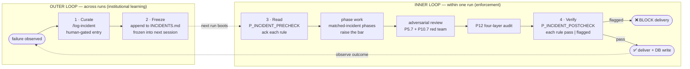

<!--
keywords: Anamnesis Research, Anamnesis Pattern, agent institutional memory, closed-loop agent harness, agent failure log, adversarial AI audit, equity research AI, agent self-correction, cross-session agent memory, harness design, red-team AI agents, CFRV cycle, veteran agent pattern
-->

# Anamnesis Research

> **An equity-research harness built on the Anamnesis Pattern — cross-session institutional memory + scheduled adversarial review.**
>
> *(Internal codename / Python module: `equiforge`. Project name everywhere user-facing: Anamnesis Research.)*

---

## The veteran vs. the junior — why this exists

Open a new context window for any agent. It starts blank. No memory of yesterday's mistake, no awareness of last quarter's near-miss, no scar tissue from the failure mode that bit you twice. Every session is a **junior employee on day one** — same blind spots, same risk of repeating yesterday's error.

Most "agent memory" designs paper over this — RAG retrieves snippets when the agent thinks to ask; auto-logged traces pile up unread; session memory dies with the chat. None of them turn the junior into a **veteran**.

A veteran is different. A veteran walks in already knowing:

- *"Last time on a private fund we tried to skip the locked template — that report had to be re-done. Don't even think about it on this one."*
- *"Auto mode is not authorization to invent a default colour palette — that cost us a full re-render once already."*
- *"When the macro factor matches a peer's prior run, reuse it; don't re-collect."*

That knowledge is what we lose every time we open a new agent context. **Anamnesis Research is what an agent harness looks like when you refuse to lose it.**

The pattern (Greek *ἀνάμνησις*, "recollection") has a four-beat closed loop that:

1. **curates** every real failure into a permanent rule (humans gate it, not auto-log),
2. **freezes** that rule into the system prompt at the start of every future session,
3. **reads** every rule explicitly at the start of every run,
4. **verifies** every rule was honoured before delivery — and **blocks shipping if any was relapsed**.

Plus a fifth axis: at named gates inside each run, two adversarial agents (a numeric attacker and a narrative attacker) actively try to break the writer's draft. Distinct from QC peers — peers vote on agreement; attackers try to falsify.

The result is an agent harness that **shows up for work as a veteran every single time**.

---

## What's distinctive

- **Cross-session institutional memory, frozen not retrieved.** `INCIDENTS.md` is loaded verbatim into every session's system prompt at boot — alongside `MEMORY.md`. The agent cannot fail to look up a rule, because the rule is already in front of it.
- **Curated, not auto-logged.** New entries to `INCIDENTS.md` come only through the `/log-incident` slash command, with the human confirming before append. This is the throttle that prevents memory inflation; auto-logging projects collapse into noise within weeks.
- **Hard enforcement, not soft warning.** `P_INCIDENT_POSTCHECK` runs before delivery and re-checks every accumulated rule. A flagged entry — relapse on a known failure — **blocks DB write**. The pipeline does not ship.
- **Adversarial review as a scheduled phase.** `P5_7_RED_TEAM` and `P10_7_RED_TEAM` fire two attackers in parallel — `red_team_numeric` (source chains, units, tolerances) and `red_team_narrative` (hidden assumptions, missing counter-evidence, score directionality). Critical findings loop the writer once.
- **QC peers and attackers are separate jobs.** Peers vote on agreement (consensus); attackers try to falsify (Popperian). Conflating them dilutes both.
- **Composition by SHA-pinned submodule, not copy.** Upstream skills (`skills_repo/er`, `skills_repo/ep`) stay in their own repos with their own maintainers; this project consumes them at pinned SHAs and adds the orchestration + cross-cutting policy. No symlinks, no aliasing.
- **Defence in depth on triggering.** Skill description match + project skill mount + UserPromptSubmit hook = three independent paths to "the model reads the right files at the right time."
- **Compliance is enforced by tests, not policy.** PII is regression-tested; HTML template is SHA256-pinned; phase contract is schema-validated. A rule that is not enforceable in code is not a rule, it is a wish.

For the full methodology (the *why* behind each of these), see `references/anamnesis_pattern.md`. For inherited principles from Anthropic's harness/skill design, see `references/inherited_principles.md`.

---

## Methodology — the Anamnesis Pattern

The pattern closes a feedback loop most agent harnesses leave open. **Two interlocking loops, plus an adversarial axis.**



The outer loop is **institutional learning across runs**: failure → curate → freeze → next session boots with the new rule. The inner loop is **enforcement within one run**: read every rule → do phase work with raised standards on matched incidents → attackers fire → P12 audits → post-check verifies no relapse → deliver, or block.

The two loops connect at exactly two files: `INCIDENTS.md` (the institutional log) and `meta/system_prompt.frozen.txt` (the per-run snapshot of what was frozen).

### The CFRV cycle (the 4 beats)

The four beats of the loop, named: **Curate · Freeze · Read · Verify**.

| Beat | What happens | Where it lives | Why this design |
|---|---|---|---|
| **1 · Curate** | A failure surfaces. A *human* (not the agent) writes one entry via `/log-incident <one-line description>`. The model drafts the entry from the latest run's digest; the human confirms before append. | `.claude/commands/log-incident.md`, `tools/io/log_incident.py` | Curation is the throttle that prevents memory inflation. Auto-logging collapses into noise; human gating forces *"is this worth being read every session forever?"* — almost everything fails that bar, and that's the point. |
| **2 · Freeze** | The entry appends to `INCIDENTS.md` and is loaded **verbatim** into the next session's system prompt at boot, alongside `MEMORY.md`. Captured to `meta/system_prompt.frozen.txt` for replay. | `INCIDENTS.md`, `workflow_meta.json -> memory_files` | Frozen, not retrieved. The agent doesn't decide whether to look up the rule — the rule is in front of it. The worst failures happen when the agent doesn't know to ask. |
| **3 · Read** | Every run's first phase, `P_INCIDENT_PRECHECK`, reads `INCIDENTS.md` end-to-end and writes one `incident_precheck.acknowledged` event per entry to `meta/run.jsonl`. Phases that match an accumulated incident raise the bar — strict reading of the contract, no shortcuts. | `agents/orchestrator.md` §1.5, `workflow_meta.json -> P_INCIDENT_PRECHECK` | Mandatory ack ensures the agent has actually processed the rule, not just been "shown" it. Resume from a fresh session re-fires this — incidents may have been added between sessions. |
| **4 · Verify** | Every run's penultimate phase, `P_INCIDENT_POSTCHECK`, re-checks each entry's detection signal. Output: `validation/incident_postcheck.json` with `pass | flagged` per incident. **Any flagged entry blocks `P_DB_INDEX`.** | `agents/orchestrator.md` §16.5, `workflow_meta.json -> P_DB_INDEX.requires` | A relapse on a known failure is more serious than a brand-new bug — the harness already knew, and the run still failed to comply. Hard halt, not warning. |

Plus the **5th axis**: scheduled adversarial review. At named gates (`P5_7_RED_TEAM` after the report draft, `P10_7_RED_TEAM` before card render), two attackers fire in parallel — `red_team_numeric` and `red_team_narrative`. These are distinct from QC peer agents (`qc_macro_peer_a/b`, `qc_porter_peer_a/b`):

| | QC peers | Red-team attackers |
|---|---|---|
| Job | vote on agreement; weighted-average; flag deltas > tolerance | try to break the writer's claim; succeed on finding a defect |
| Output | score deltas → audit trail | challenge list with severity → loop writer if critical |
| Loop budget | high (cap = 3) | low (cap = 1) |
| Clean output is | suspicious — peers usually disagree on something | acceptable — a clean draft is a valid result |

A clean attacker output (zero findings) is valid. The harness must not pressure attackers to manufacture issues.

### How this differs from other agent memory designs

| | Anamnesis Pattern | Vector RAG memory | Session memory | Auto-logging |
|---|---|---|---|---|
| Cross-session | ✓ frozen at boot | ✓ retrieved on query | ✗ | ✓ |
| Curated | ✓ human-gated | ✗ | n/a | ✗ |
| Read mandatory pre-run | ✓ | ✗ (only if model asks) | n/a | rarely |
| Verified post-run | ✓ | ✗ | ✗ | ✗ |
| Relapse blocks delivery | ✓ | ✗ | ✗ | ✗ |
| Scales as log grows | ✓ curation throttle | degrades — noise dilutes retrieval | n/a | degrades — noise floods log |
| Adversarial review | ✓ scheduled phases | ✗ | ✗ | ✗ |

The pattern's distinguishing claim: **a rule worth keeping is worth pre-checking, post-checking, and blocking on**. Anything weaker is a wish.

### The pattern is general — equity research is one instance

The Anamnesis Pattern applies to any agent harness where:

- Runs are **repeatable production work** (not one-off Q&A).
- Failures are **expensive enough** to be worth permanent rules.
- The deliverable is a **file tree** (artifacts, not just chat replies).
- You have at least one **human curator** willing to gatekeep `/log-incident`.

| Domain | What earns an INCIDENTS entry | Adversarial axis |
|---|---|---|
| **Equity research** *(this repo)* | P0 gate bypass; locked template skipped on private fund | numeric attacker (sources/units/tolerance) + narrative attacker (Porter direction, counter-evidence) |
| Legal brief drafting | misciting an overturned precedent; missing a jurisdictional element | citation auditor + counter-argument generator |
| Medical diagnosis support | suggesting a ruled-out condition; ignoring a black-box warning | lab-value cross-check + differential-diagnosis devil's advocate |
| Automated code review | repeating a known-rejected refactor; suggesting a deprecated API | static-analysis cross-check + "would this work in prod?" challenger |
| Compliance audit | applying a deprecated control; missing a control that became required | control-coverage matrix + "what's conspicuously absent?" |

The minimum viable Anamnesis harness is: an INCIDENTS-style file + frozen-at-boot + a 2-phase bracket + 2 adversarial agents + a curation command. Anamnesis Research wraps that minimum in an equity-research-specific 33-phase pipeline; your harness can wrap it in something else.

Full pattern definition (with anti-patterns, applicability checklist, and required files): `references/anamnesis_pattern.md`.

---

## Repository layout

Anamnesis Research is a **harness-backed skill**: delivered as a skill (`SKILL.md` is the auto-trigger entry), maintained as a production harness (`HARNESS.md` is the architecture doc).

```
anamnesis-research/                 # codename: equiforge (kept in file paths for compatibility)
├── SKILL.md                        # ★ thin skill entry — boot order, P0 gates, pointers
├── HARNESS.md                      # harness/architecture/CLI/tests
├── MEMORY.md                       # project invariants — frozen at session start
├── INCIDENTS.md                    # ★ append-only failure log — frozen at session start
├── USER.md                         # per-user preferences (gitignored; copy from .template)
├── workflow_meta.json              # machine-readable phase/gate contract (33 phases)
├── equiforge.py                    # CLI entry (codename retained as Python module name)
│
├── .claude/                        # Claude Code project-scoped configuration
│   ├── skills/anamnesis-research/SKILL.md   # project skill mount (auto-discovery)
│   ├── settings.json               # hooks block
│   ├── hooks/inject_incidents.py   # UserPromptSubmit safety net (incident reminder)
│   └── commands/log-incident.md    # /log-incident slash command (the Curate beat)
│
├── agents/                         # project-owned briefs (orchestrator, gates, auditors, attackers)
│   ├── orchestrator.md             # the runtime brief that drives one run
│   ├── intent_resolver.md
│   ├── language_gate.md / sec_email_gate.md / palette_gate.md
│   ├── post_card_auditor.md
│   ├── cross_validator.md
│   └── attackers/                  # ★ red-team adversarial reviewers
│       ├── red_team_numeric.md     # numeric/source-chain/tolerance falsifier
│       └── red_team_narrative.md   # narrative/Porter-direction/counter-evidence falsifier
│   # upstream ER/EP agents stay under skills_repo/ — see HARNESS.md "ownership" section
│
├── references/                     # lazy-loaded skill docs
│   ├── anamnesis_pattern.md        # ★ the methodology, generalised — start here for the pattern
│   ├── inherited_principles.md     # principles inherited from Anthropic harness/skill design
│   ├── workflow_diagram.md         # mermaid diagram of the 33-phase pipeline
│   ├── phase_contract.md           # prose narrative of every phase
│   ├── p0_gates.md                 # per-gate whitelist + sticky source rules
│   ├── subagent_toolsets.md        # per-agent toolset matrix
│   ├── run_artifacts.md            # what lands where in output/
│   ├── cross_quarter.md            # DB reuse across runs
│   └── maintenance.md              # template SHA, palette, schema, submodule bumps
│
├── tools/                          # registered Python CLIs
│   ├── research/                   # template extract, HTML gate, packaging check, workflow validator
│   ├── photo/                      # validate_cards, render_cards
│   ├── audit/                      # reconcile_numbers, ocr_cards, web_third_check, db_cross_validate
│   ├── db/                         # queries (read), index_run (write)
│   ├── web/                        # search-only
│   └── io/                         # run_dir bootstrap, log_incident digest
│
├── skills_repo/                    # git submodules — SHA-pinned upstream skills
│   ├── er/                         # Equity Research Skill (P1..P6)
│   └── ep/                         # Equity Photo Skill (P7..P11)
│
├── db/
│   ├── equity_kb.sqlite            # gitignored runtime; built from db/schema/
│   ├── schema/00X_*.sql            # numbered, additive migrations
│   ├── seed/                       # optional fixture data
│   └── sector_reports/             # gitignored, regenerated on demand
│
├── tests/                          # pytest suite (PII regression, migrations, reconcile, etc.)
└── output/                         # gitignored runtime — one folder per run
    └── {Company}_{Date}_{RunID}/   # see references/run_artifacts.md
```

---

## Quick start

```bash
git clone <this-repo-url> anamnesis-research
cd anamnesis-research
git submodule update --init --recursive    # pull ER + EP submodules (SHA-pinned)
pip install -r requirements.txt
python equiforge.py init                   # build db/equity_kb.sqlite (codename retained as module)
cp USER.md.template USER.md                # then edit defaults

# Open the project in Claude Code (or any host that auto-discovers .claude/skills/),
# then type:  研究一下苹果   (or)   research Apple
#
# The skill auto-triggers, the harness reads INCIDENTS.md (P_INCIDENT_PRECHECK), walks
# the four P0 gates, runs the research and card pipelines, fires red-team attackers at
# P5.7 and P10.7, audits via P12, re-checks INCIDENTS at P_INCIDENT_POSTCHECK, and lands
# a per-run output folder + DB rows.
```

When a new failure mode happens, capture it as a permanent rule:

```
/log-incident P0_palette gate skipped — orchestrator picked default in auto mode
```

The model will pull the latest run's digest, draft a candidate `INCIDENTS.md` entry matching the existing format, and show it to you for review. After your confirmation, it appends to `INCIDENTS.md` — and from the next session on, that rule is frozen into the system prompt and post-checked at delivery.

---

## What this repo produces

Anamnesis Research applies the pattern to a **33-phase pipeline** that fuses two upstream skills:

- **Equity Research** — multi-agent research → interactive HTML report (locked SHA256-pinned template; no simplified bypass per `INCIDENTS.md` I-002)
- **Equity Photo** — HTML → 6 fixed-layout PNG social cards (2160×2700, palette-locked)

into one end-to-end workflow with a SQLite knowledge base, a four-layer post-card audit, and red-team adversaries at the report and card stages.

**One prompt → full delivery.** Type `研究一下苹果` (or `research Apple`); the harness:

1. Reads `INCIDENTS.md` end-to-end (`P_INCIDENT_PRECHECK`)
2. Walks the four P0 gates (intent, language, SEC email if US-listed, palette) — interactive gates halt and wait; auto mode does not waive them (per I-001)
3. Runs the research pipeline (financials / macro / news in parallel, edge insight, financial analysis, prediction waterfall, QC peers, Porter analysis, cross-validation)
4. Writes the HTML report by filling the locked skeleton; data validator clears it; **red team falsifies it** (`P5_7_RED_TEAM`)
5. Builds 6 cards (logo ≥840 px, content, hardcode audit, layout fill, validators 1 and 2); **red team falsifies them pre-render** (`P10_7_RED_TEAM`)
6. Renders 6 PNGs at 2160×2700; runs the four-layer P12 audit (numerical reconciliation + OCR + web third-check + DB cross-validation)
7. Re-checks `INCIDENTS.md` (`P_INCIDENT_POSTCHECK`) — flagged blocks DB write
8. Lands a per-run output folder with research JSON, HTML report, 6 PNG cards, QA report, validation JSONs, and DB rows

For the visual diagram see `references/workflow_diagram.md`. For the prose phase narrative see `references/phase_contract.md`. For the machine contract see `workflow_meta.json`.

---

## Cross-quarter and cross-company reuse

After a few runs, the database lets you:

- **Skip macro re-collection** — if a run for *any* US-listed company in 2026Q2 has already collected the 6-factor US macro vector, the next 14 days of US runs short-circuit `macro_scanner` and pull from DB.
- **Cross-validate against history** — running Apple in Q3 will compare the new financials against Apple's Q1/Q2 rows already in DB; YoY > 5pp delta from reported flags as CRITICAL.
- **Cross-validate against peers** — Apple's Porter `rivalry=3` while Samsung (DB) is `5`: P12 flags as a peer-divergence warning.
- **Generate sector reports** — `python tools/db/sector_report.py --type porter_heatmap --sector "Information Technology" --period 2026Q2` produces a force × peer matrix HTML+JSON.

---

## Privacy

- SEC EDGAR User-Agent emails are never persisted. They live for the duration of one HTTP request only.
- `tests/test_db_pii.py` asserts that no row in any TEXT column matches an email regex after a known-input fixture run.

---

## Status

The machine-readable orchestration contract is `workflow_meta.json` (33 phases, gates, tools, agents). Upstream skills (`skills_repo/er`, `skills_repo/ep`) are pinned by SHA via `.gitmodules`; submodule bumps are deliberate and logged in `meta/submodule_shas.json` per run. Pre-check and post-check are non-skippable; `P_DB_INDEX` declares `requires: [P12_final_audit, P_INCIDENT_POSTCHECK]` so machine-readable runners cannot bypass either gate.

---

## License

Apache-2.0, matching both upstream skills.
