# The Anamnesis Pattern

> *Anamnesis* (Greek ἀνάμνησις, "recollection") — Plato's term for the soul calling to mind knowledge held from prior lives. The metaphor: every new agent context window is amnesiac. The pattern lets the agent recollect, every session, what it learned the hard way in every previous one.

This file defines a **methodology** for building production agent harnesses, abstracted away from any one application. equiforge is one implementation (applied to equity research); the pattern is the reusable contribution. Read this if you are designing a new harness — for legal research, medical diagnosis, code review, support triage, or any pipeline where failures are expensive enough to be worth permanent rules.

For why the pattern exists in equiforge specifically, see `INCIDENTS.md`. For inherited harness/skill principles (Anthropic's foundational guidance) that this pattern *builds on top of*, see `references/inherited_principles.md`.

## The problem the pattern solves

Most agent harnesses are amnesiac across sessions. A new context window starts blank. The agent's tendency to repeat past mistakes — wrong-language report, skipped gate, hand-written shortcut around a locked template — is bounded only by whatever rules are encoded in the live system prompt. Three common partial responses, all insufficient:

| Approach | What it does | Why insufficient |
|---|---|---|
| **Vector / RAG memory** | retrieves "relevant" past context on demand | the agent decides what to retrieve; misses what it doesn't know to ask for |
| **Session memory** | remembers within one chat | dies when the session ends |
| **Auto-logging traces** | stores everything | no signal-to-noise control; no enforcement loop; no relapse detection |

The Anamnesis Pattern closes the gap: every accumulated rule is read at the start of every session, verified at the end, and enforced as a delivery gate. Failure to obey a known rule is release-blocking, not advisory.

## The pattern at a glance

The pattern is **two interlocking loops** plus one **adversarial axis**:

```mermaid
flowchart LR
    subgraph OUTER["OUTER LOOP — across runs (institutional learning)"]
      direction LR
      F([failure observed]) --> CURATE["1 · Curate<br/>human-gated entry<br/>via /log-incident"]
      CURATE --> FREEZE["2 · Freeze<br/>append to INCIDENTS.md<br/>frozen into next session prompt"]
    end

    FREEZE -.next run boots.-> READ

    subgraph INNER["INNER LOOP — within one run (enforcement)"]
      direction TB
      READ["3 · Read<br/>pre-check phase<br/>ack each accumulated rule"]
      READ --> WORK[phase work<br/>matched-incident phases<br/>raise the bar]
      WORK --> ATTACK[adversarial review<br/>scheduled red-team gates]
      ATTACK --> AUDIT[domain-specific audit<br/>e.g. P12 in equiforge]
      AUDIT --> VERIFY["4 · Verify<br/>post-check phase<br/>each rule pass | flagged"]
      VERIFY -->|flagged| BLOCK([❌ BLOCK delivery])
      VERIFY -->|pass| DELIVER([✅ deliver])
    end

    DELIVER -.observe outcome.-> F

    classDef beat fill:#fff3cd,stroke:#b8860b,stroke-width:2px,color:#000
    classDef terminal fill:#dcfce7,stroke:#15803d,color:#000
    classDef block fill:#fecaca,stroke:#991b1b,color:#000
    class CURATE,FREEZE,READ,VERIFY beat
    class DELIVER terminal
    class BLOCK block
```



## The CFRV cycle (the 4 beats)

### 1. Curate — human-gated, not auto-logged

When a failure happens, a human writes one append-only entry. The entry has a fixed minimum schema:

- a unique id (`I-NNN`, monotonic)
- the **phase** where the failure surfaced
- **what happened** (concrete; with paths from the run digest, not generic)
- **root cause** (the assumption or shortcut that produced the failure)
- **rule** (load-bearing — must be enforceable, not advice)
- **detection** (which tool / file / test catches it)

Curation is the **throttle that prevents memory inflation**. Auto-logged systems pile up noise: every warn becomes an entry, every minor variance becomes a rule, and the prompt eventually drowns. Human curation forces the question *"is this worth being read every session forever?"* — almost everything fails that bar, and that is the point.

In equiforge: `/log-incident` slash command. The model drafts; the human confirms. Backed by `tools/io/log_incident.py --collect` which produces a digest of the latest run for the human to review.

### 2. Freeze — append-only, frozen at boot, not retrieved

The entry is appended to a single source-of-truth file (`INCIDENTS.md` in equiforge). At session boot, the entire file is loaded **verbatim** into the system prompt alongside the project's other invariants (`MEMORY.md`). It is not chunked, embedded, or retrieved on demand. The frozen prompt is captured to `meta/system_prompt.frozen.txt` so audits can replay.

Why frozen and not retrieved:

- The agent does not know what it does not know. Retrieval requires the agent to think to ask for the rule; the worst failures happen when it doesn't.
- Append-only with frozen-at-boot means a failure logged at 10am applies to every run from 10:01am onward, no model decision required.
- The cost of "always include all rules in prompt" is bounded by the curation throttle — if INCIDENTS.md grows past prompt budget, that is a signal to revisit which entries are genuinely load-bearing, not to switch to retrieval.

### 3. Read — mandatory pre-check phase

Every run's first phase reads INCIDENTS.md end-to-end and writes one acknowledgement event per entry to the append-only run log:

```json
{"phase": "P_INCIDENT_PRECHECK", "event": "incident_precheck.acknowledged", "incident_id": "I-001", "ack": "<one-line acknowledgement>"}
```

When the run reaches a phase whose `Phase` field matches an accumulated incident, the agent **raises the bar** on that surface — strict reading of the contract, no shortcuts, additional cross-checks. The acknowledgement is written before phase work begins; resume-from-log treats a fresh session as needing fresh acks (rules may have been added between sessions).

In equiforge: `P_INCIDENT_PRECHECK` runs before `P0_intent`.

### 4. Verify — mandatory post-check phase, release-blocking

Before delivery, the run re-reads INCIDENTS.md and confirms each entry's detection signal is green. Output is one entry per incident:

```json
{"id": "I-NNN", "status": "pass | flagged", "evidence": "<file path that proves it>"}
```

Any `flagged` entry **blocks delivery**. Not a warning, not a yellow flag — a hard halt that surfaces the relapse to the user with the exact path that violates the rule. Relapse on a known failure is treated as more serious than a brand-new bug, because the harness already knew about it and the run still failed to comply.

In equiforge: `P_INCIDENT_POSTCHECK` blocks `P_DB_INDEX`. A flagged post-check means the database is not written for that run. Declared in `workflow_meta.json` as `requires: [domain_audit, P_INCIDENT_POSTCHECK]` so machine-readable runners cannot bypass it.

## The 5th axis — scheduled adversarial review

Orthogonal to memory, the pattern includes **named adversarial-review phases** at high-risk gates inside the inner loop. At each gate, run two attackers in parallel:

- **Numeric attacker** — attacks values, source chains, units, tolerance compliance, internal consistency.
- **Narrative attacker** — attacks story-arc claims, hidden assumptions, missing counter-evidence, score directionality, cross-artifact coherence.

These are **distinct** from quality-control peer review:

| | QC peers | Adversarial attackers |
|---|---|---|
| Job | vote on agreement; weighted-average; flag deltas > tolerance | try to break the writer's claim; succeed when they find a defect |
| Output | score deltas → audit trail | challenge list with severity → loop the writer if critical |
| Loop budget | high (e.g. 3) | low (e.g. 1) |
| Clean output is | suspicious (peers usually disagree on something) | acceptable (a clean draft is a valid result) |
| Risk if conflated | diluted votes mask single-source defects | adversarial loops drown the writer in subjective criticism |

A clean attacker output (zero findings) is a valid result. The harness must not pressure attackers to manufacture issues. Conversely, a draft that dismisses an attacker's critical finding without writing why is release-blocking.

In equiforge: `P5_7_RED_TEAM` after the report draft, `P10_7_RED_TEAM` before card render.

## How this differs from other "agent memory" designs

| | Anamnesis Pattern | Vector RAG memory | Session memory | Auto-logging |
|---|---|---|---|---|
| Cross-session | ✓ (frozen at boot) | ✓ (retrieved on query) | ✗ | ✓ |
| Curated | ✓ (human-gated) | ✗ | n/a | ✗ |
| Read mandatory pre-run | ✓ | ✗ (only if model decides) | n/a | rarely |
| Verified post-run | ✓ | ✗ | ✗ | ✗ |
| Relapse blocks delivery | ✓ | ✗ | ✗ | ✗ |
| Scales as log grows | ✓ (curation throttle) | degrades (noise-diluted retrieval) | n/a | degrades (noise) |
| Adversarial review | ✓ (scheduled phases) | ✗ | ✗ | ✗ |

The pattern's distinguishing claim: **a rule worth keeping is worth pre-checking, post-checking, and blocking on**. A rule that fails any of those three tests is a wish, not a rule.

## When to apply

The pattern is appropriate when:

- The harness has **repeatable production runs** (not one-off Q&A).
- Failures are **expensive enough** to be worth permanent rules — money, regulatory exposure, customer trust, factual reputation.
- The domain has a **deliverable artifact tree** (files in a folder), not just a chat reply.
- You can name **adversarial gates** where falsification is meaningful (numbers to check, claims to challenge).
- You have at least one **human curator** willing to gatekeep `/log-incident`.

Examples beyond equity research where this would apply:

| Domain | Failures that earn an INCIDENTS entry | Adversarial axis |
|---|---|---|
| Legal brief drafting | misciting a precedent that was overturned; missing a jurisdictional element | numeric attacker = citation auditor; narrative attacker = counter-argument generator |
| Medical diagnosis support | suggesting a ruled-out condition; ignoring a black-box warning | numeric attacker = lab-value cross-check; narrative attacker = differential diagnosis devil's advocate |
| Automated code review | repeating a known-rejected refactor; suggesting a deprecated API | numeric attacker = static-analysis cross-check; narrative attacker = "would this actually work in prod?" challenger |
| Support ticket triage | auto-responding with an answer the customer rejected last week; misclassifying severity | numeric attacker = SLA-breach detector; narrative attacker = "is this really the same issue as the linked one?" |
| Compliance audit | applying a deprecated control; missing a control that became required | numeric attacker = control-coverage matrix; narrative attacker = "what control is conspicuously absent?" |

## When NOT to apply

The pattern over-engineers when:

- Runs are **single-shot Q&A** with no persistent artifact.
- Failures are **cheap** (a wrong reply costs nothing more than a re-ask).
- The domain has **no human willing to curate** an incident log — auto-logging will collapse into noise within weeks without the curation throttle.
- The harness is **early-stage** and you don't yet have at least 2–3 real failure modes to seed INCIDENTS.md. Don't add the bracket phases speculatively.

A conservative path: build the harness without the pattern first. Once you have hit the *same* failure mode twice, that is your signal to add the pattern, with that failure mode as the seed entry.

## Anti-patterns to avoid

1. **Auto-populated INCIDENTS.md.** Defeats curation. Within weeks the file is unreadable.
2. **Retrieval-based incident lookup** (RAG over INCIDENTS.md). Defeats the "agent doesn't know what it doesn't know" guarantee.
3. **Soft post-check** (warning instead of block). Defeats enforcement. Within months developers learn to ignore the warnings.
4. **Adversarial agents that vote with QC peers.** Conflates falsification with consensus. Both jobs degrade.
5. **Editing past INCIDENTS entries.** Defeats append-only auditability. Supersede with a new entry that links back.
6. **Skipping pre-check on resume.** Defeats freshness — INCIDENTS.md may have been updated between the original session and the resume. Always re-fire pre-check on a fresh session boot.
7. **Burying the post-check inside the audit phase.** They are different jobs. Audit checks "is this run's data correct"; post-check checks "did this run relapse on a known failure". Combining them lets a clean audit hide a relapse.

## Required files (the pattern's footprint)

The pattern requires (with equiforge-specific filenames in parentheses):

| Concern | File / surface | Frequency |
|---|---|---|
| Append-only failure log | `INCIDENTS.md` | one per project |
| Frozen-at-boot system memory | included verbatim alongside `MEMORY.md` | one per session |
| Pre-check phase | `P_INCIDENT_PRECHECK` (orchestrator delegated) | one per run |
| Post-check phase | `P_INCIDENT_POSTCHECK` | one per run |
| Adversarial agent — numeric | `agents/attackers/red_team_numeric.md` | one per project (parameterised by gate) |
| Adversarial agent — narrative | `agents/attackers/red_team_narrative.md` | one per project (parameterised by gate) |
| Curation entry-point | `/log-incident` slash command + collector | one per project |
| Machine-readable phase contract | declares `requires: [audit, post_check]` for delivery | one per project |
| Frozen prompt audit trail | `meta/system_prompt.frozen.txt` (per run) | one per run |
| Run event log (append-only) | `meta/run.jsonl` | one per run |
| Pre-check ack events | written by orchestrator into `meta/run.jsonl` | one per incident per run |
| Post-check verdict | `validation/incident_postcheck.json` | one per run |

The minimum viable Anamnesis harness is: INCIDENTS.md + frozen-at-boot + a 2-phase bracket + 2 adversarial agents + a curation command. Everything else is optional sophistication.

## Diagnosing a harness against the pattern

Reviewing an existing harness for Anamnesis-readiness, ask:

1. Is there a single human-curated append-only failure log? (If no, the pattern does not apply yet — start the log.)
2. Is the entire log loaded into the system prompt at session boot? (If retrieved instead, you have RAG memory, not Anamnesis.)
3. Is there a mandatory phase that reads and acks every entry before any work starts? (If no, the agent will skip on busy days.)
4. Is there a mandatory phase that re-checks each entry before delivery and blocks on failure? (If a soft warning, the pattern is still aspirational, not enforced.)
5. Is there at least one named gate where adversarial attackers fire in parallel? (If reviews are all consensus-style, single-source defects will leak.)

If you can answer yes to all five, the pattern is implemented. If you can answer yes to (1) and (2) but not (3)–(5), you have **stored** institutional memory; you have not yet **enforced** it.
