# equiforge — workflow diagram

**Reading rules**

- ⭐ marks the four non-skippable phases that bracket the original pipeline: institutional memory pre/post-check and adversarial red-team review.
- 🔒 marks interactive P0 gates that **halt and wait** for a real user reply (or sticky `USER.md`); auto mode does not waive them.
- ↩ marks loops with their cap.
- Parallel groups are drawn as fan-out/fan-in.
- If this prose disagrees with `workflow_meta.json`, the JSON wins.

## Full pipeline

```mermaid
flowchart TD
    Start([User: research Apple / 研究苹果])

    %% ====== INCIDENT PRECHECK ======
    Start --> PRE["⭐ P_INCIDENT_PRECHECK<br/>read INCIDENTS.md end-to-end<br/>ack each I-NNN → run.jsonl"]

    %% ====== P0 GATES ======
    PRE --> P0i[P0_intent<br/>ticker / company / listing]
    P0i --> P0L["🔒 P0_lang — en or zh<br/>INTERACTIVE"]
    P0L --> P0S["🔒 P0_sec_email<br/>US + mode A only — INTERACTIVE"]
    P0S --> P0P["🔒 P0_palette<br/>macaron / default / b / c — INTERACTIVE"]
    P0P --> P0M[P0M_meta<br/>validate workflow_meta.json]
    P0M --> P0DB[P0_DB_PRECHECK<br/>prior fins / peers / macro snapshot]

    %% ====== P1 PARALLEL RESEARCH ======
    P0DB --> P1fan{{P1 parallel research<br/>concurrency = 3}}
    P1fan --> P1A[financial_data_collector]
    P1fan --> P1B[macro_scanner]
    P1fan --> P1C[news_researcher]
    P1A --> P15
    P1B --> P15
    P1C --> P15[P1.5 edge_insight_writer]

    %% ====== P2 / P2.5 / P2.6 ======
    P15 --> P2[P2 financial_analysis · inline]
    P2 --> P25[P2.5 prediction_waterfall · inline]
    P25 --> P26fan{{P2.6 macro QC peers · parallel}}
    P26fan --> P26A[qc_macro_peer_a]
    P26fan --> P26B[qc_macro_peer_b]
    P26A --> P3
    P26B --> P3

    %% ====== P3 / P3.5 / P3.6 / P3.7 ======
    P3[P3 porter_analysis · inline] --> P35fan{{P3.5 porter QC peers · parallel}}
    P35fan --> P35A[qc_porter_peer_a]
    P35fan --> P35B[qc_porter_peer_b]
    P35A --> P36
    P35B --> P36[P3.6 qc_resolution_merge]
    P36 --> P37[P3.7 cross_validator<br/>history / peer / macro drift]

    %% ====== P4 / P5 / P5_gate / P5.5 ======
    P37 --> P4[P4 inject Sankey payload]
    P4 --> P5[P5 report_writer_cn/en<br/>fill SHA256-pinned skeleton]
    P5 --> P5G{P5_gate<br/>validate_report_html.py}
    P5G -->|exit ≠ 0| P5
    P5G -->|exit 0| P55[P5.5 final_report_data_validator]
    P55 -->|"critical ↩ cap=2"| P5

    %% ====== P5.7 RED TEAM ======
    P55 -->|0 critical| P57fan{{"⭐ P5.7 RED TEAM · parallel"}}
    P57fan --> P57N[red_team_numeric]
    P57fan --> P57R[red_team_narrative]
    P57N --> P57join((merge))
    P57R --> P57join
    P57join -->|"critical ↩ cap=1<br/>combined revision"| P5
    P57join -->|0 critical| P6

    %% ====== P6 ======
    P6[P6 packaging_check + report_validator<br/>profile ∈ 4 strict_*<br/>status ∈ pass / warn / critical]

    %% ====== P7 / P8 / P8.5 / P9 ======
    P6 --> P7[P7 logo_production<br/>≥ 840 px · save into cards/ first]
    P7 --> P8[P8 content_production<br/>card_slots.json — 17 keys]
    P8 --> P85[P8.5 hardcode_audit]
    P85 --> P9[P9 layout_fill<br/>char / pixel budgets]
    P9 --> P10[P10 Validator 1<br/>validate_cards.py]
    P10 --> P105[P10.5 Validator 2<br/>web fact-check]
    P105 -->|"change ↩ cap=3"| P10

    %% ====== P10.7 RED TEAM ======
    P105 -->|stable| P107fan{{"⭐ P10.7 RED TEAM · parallel<br/>PRE-RENDER ONLY · no PNG OCR here"}}
    P107fan --> P107N[red_team_numeric<br/>render-budget · palette · logo path]
    P107fan --> P107R[red_team_narrative<br/>Porter direction · cross-card coherence]
    P107N --> P107join((merge))
    P107R --> P107join
    P107join -->|"critical layout ↩ cap=1"| P9
    P107join -->|critical content| P8
    P107join -->|0 critical| P11

    %% ====== P11 RENDER ======
    P11[P11 render_cards.py<br/>6 PNGs · 2160×2700 · palette = P0_palette]

    %% ====== P12 FOUR-LAYER AUDIT ======
    P11 --> P12[P12 final_audit ★<br/>post_card_auditor]
    P12 --> P12L1[L1 reconcile_numbers · blocks]
    P12L1 --> P12L2[L2 ocr_cards · blocks]
    P12L2 --> P12L3[L3 web_third_check · blocks]
    P12L3 --> P12L4[L4 db_cross_validate · cold-start OK]

    %% ====== INCIDENT POSTCHECK ======
    P12L4 --> POST["⭐ P_INCIDENT_POSTCHECK<br/>re-read INCIDENTS.md<br/>each entry: pass | flagged"]
    POST -->|"any flagged"| Halt([❌ HALT · surface to user · do NOT write DB])
    POST -->|"flagged: []"| PDB

    %% ====== DB INDEX ======
    PDB[P_DB_INDEX<br/>requires: P12 pass AND postcheck pass<br/>single transaction · rollback on failure]
    PDB --> Done([✅ Deliver: HTML + 6 PNGs + DB rows + QA report])

    %% ====== STYLES ======
    classDef bracket fill:#fff3cd,stroke:#b8860b,stroke-width:2px,color:#000
    classDef interactive fill:#ffe4b5,stroke:#cd853f,stroke-width:2px,color:#000
    classDef parallel fill:#e0f2fe,stroke:#0369a1,stroke-width:1px,color:#000
    classDef audit fill:#fee2e2,stroke:#b91c1c,stroke-width:2px,color:#000
    classDef terminal fill:#dcfce7,stroke:#15803d,stroke-width:2px,color:#000
    classDef halt fill:#fecaca,stroke:#991b1b,stroke-width:2px,color:#000

    class PRE,POST,P57fan,P107fan bracket
    class P0L,P0S,P0P interactive
    class P1fan,P26fan,P35fan parallel
    class P12,P12L1,P12L2,P12L3,P12L4 audit
    class Done terminal
    class Halt halt
```

## Loop budgets at a glance

| Loop | From | To | Cap |
|---|---|---|---|
| Data validation rewrite | P5.5 critical | P5 | 2 |
| HTML gate fail | P5_gate exit ≠ 0 | P5 | 2 |
| **Red team report** | P5.7 critical | P5 | **1** |
| Validator 2 ↔ Validator 1 | P10.5 change | P10 | 3 |
| **Red team cards (layout)** | P10.7 critical | P9 | **1** |
| **Red team cards (content)** | P10.7 critical | P8 | **1** |
| ER subagent retry (same prompt) | any P1/P2/P3 fail | self | 2 |
| Subagent timeout retry | any subagent | self ×1.5 | 1 |
| **P12 auto-retry** | P12 fail | — | **0** (surface to user) |
| **Postcheck flagged retry** | postcheck fail | — | **0** (surface to user) |

## Where each artifact lands

| Phase output | Path |
|---|---|
| Frozen system prompt (MEMORY + INCIDENTS) | `meta/system_prompt.frozen.txt` |
| Pinned submodule SHAs | `meta/submodule_shas.json` |
| Append-only event log | `meta/run.jsonl` |
| P0 gate provenance | `meta/gates.json` |
| Red-team manifests | `meta/red_team/{phase_id}.input.json` |
| Red-team verdicts | `validation/red_team_{numeric,narrative}_{phase}.json` |
| P12 audit + QA report | `validation/post_card_audit.json` + `validation/QA_REPORT.md` |
| Incident post-check verdict | `validation/incident_postcheck.json` |
| HTML report | `research/{Company}_Research_{LANG}.html` |
| 6 PNGs | `cards/0{1..6}_*.png` |
| DB write summary | `db_export/rows_written.json` |

## What the colours mean (in the rendered diagram)

- 🟡 **yellow / gold** — ⭐ bracket phases: incident pre/post-check and red-team fan-outs
- 🟠 **orange** — 🔒 interactive P0 gates (halt and wait)
- 🔵 **blue** — parallel fan-out points
- 🔴 **red** — P12 paying-customer audit layers
- 🟢 **green** — successful delivery
- 🟥 **dark red** — release-blocking halt

## Quick read

The pipeline is bracketed. **Outside the bracket** are user prompt and DB write. **Inside the bracket** are 31 phases, of which:

- 4 ⭐ phases are the harness's institutional-memory loop and adversarial-review fire — they exist *because* of past failures (`INCIDENTS.md`).
- 3 🔒 phases halt for the user — auto mode does not waive them.
- 2 dual-attacker fan-outs run in parallel (numeric + narrative), each gated by a single combined revision loop.
- 4 P12 layers each fail-block independently except L4 (DB cross), which is cold-start tolerant.
- The DB write at the very end requires **both** P12 pass *and* postcheck `flagged: []` — declared as `requires: [P12_final_audit, P_INCIDENT_POSTCHECK]` in `workflow_meta.json`.
